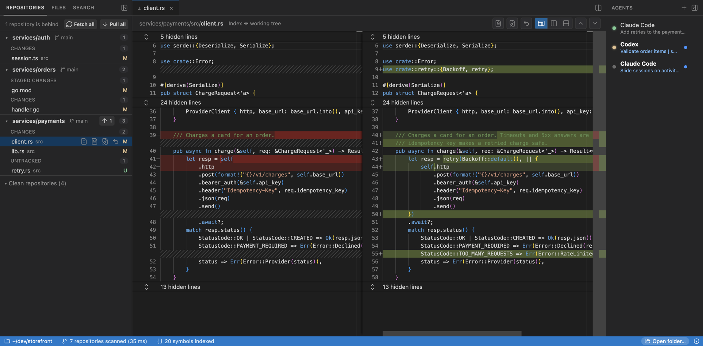

# Gako

A lean desktop app for reviewing and supervising coding agents across many Git repositories at
once. For macOS, Windows and Linux.

Gako is for a base folder holding several independent repositories, as microservice codebases,
robotics workspaces and polyrepo teams have. Agents work in their own terminal interfaces; Gako
shows you what they changed in every repository, tells you which of them need you, and stays out of
the way of your editor.



## What it does

- **Every repository in one view.** Gako finds the repositories under a folder and lists the ones
  with changes, each with its branch, its sync state and its changed files. Clean repositories fold
  away. Fetch, pull, push, switch branch or revert a file without leaving the list.
- **Agents in real terminals.** Start Claude Code, Codex, OpenCode, Pi or any other program in any
  repository. The agent bar shows which agents are working, which have finished while you were
  away, and which are waiting for your approval.
- **Review without an editor's weight.** Read-only diffs and files with syntax highlighting, each
  repository's history, search scoped to the repositories you choose, and go to definition across
  all of them.
- **Your editor for editing.** Gako never edits code. "Open in editor" opens the file at the right
  line in VS Code, Zed, Cursor or the editor you configure.
- **Light.** Idle, Gako uses about a seventh of VS Code's memory on the same machine; with four
  agents running, about a quarter. See [docs/performance.md](docs/performance.md).

## Status

Version 0.9.0, the first public release. Gako is used every day on macOS. It runs on Windows and
Linux, but they have had less use, and Windows hasn't been through the measurement suites yet.
There are no prebuilt or signed packages yet: build it from source, as below.

## Install

You need [Rust](https://rustup.rs) (via rustup), [Node.js](https://nodejs.org) (LTS or newer) and
Git. On Windows, Rust also needs the Visual Studio Build Tools with "Desktop development with C++".

```bash
git clone https://github.com/gako-app/gako.git
cd gako
npm install
npm run package
```

This builds Gako into `dist/`:

- **macOS:** `Gako.app`. Copy it to `/Applications`.
- **Windows:** a `Gako` folder with `Gako.exe`. Keep the whole folder on a local disk, such as
  `C:\Tools\Gako` or `%LOCALAPPDATA%\Programs\Gako`. Started from a network drive or a redirected
  folder, as corporate profiles and remote desktop hosts often have, Chromium can't start its
  helper processes, and Gako says so and quits.
- **Linux:** a `gako` folder with the `gako` executable. On systems that restrict unprivileged
  user namespaces, such as Ubuntu 24.04, Chromium's sandbox needs the folder's `chrome-sandbox` to
  be owned by root and setuid: `sudo chown root chrome-sandbox && sudo chmod 4755 chrome-sandbox`.

The package isn't signed, so it's meant for the machine that built it.

To run Gako from the repository instead, while working on it:

```bash
npm run app -- /path/to/your/folder
```

## Using it

Gako opens the folder given on its command line (`open -a Gako --args /path/to/folder` on macOS),
or the last one it had open, or asks. **Open folder…** in the status bar picks another.

| Shortcut (macOS / elsewhere) | |
|---|---|
| ⌘P / Ctrl+P | Go to file |
| ⌘T / Ctrl+T | Go to symbol |
| ⌘⇧F / Ctrl+Shift+F | Search in files |
| F12, or ⌘-click / Ctrl-click | Go to definition |
| Shift+F12 | Find references (by name) |
| ⌘W / Ctrl+W | Close the tab in front |
| Ctrl+Tab, Ctrl+Shift+Tab | Next and previous tab |
| ↑ ↓ in the sidebar | Next and previous changed file |

Gako has no settings screen: settings are a JSON file, described in
[docs/settings.md](docs/settings.md). The About window (ⓘ at the right of the status bar) shows
where it is, along with the version, the licence and the third-party notices.

## Documentation

[docs/](docs/README.md) explains how each part works and why: [the Git view](docs/git.md),
[terminals and agents](docs/terminals.md), [files, search and navigation](docs/navigation.md),
[the architecture](docs/architecture.md) and [the decisions behind it](docs/decisions.md).

## Contributing

Bug reports and pull requests are welcome; [CONTRIBUTING.md](CONTRIBUTING.md) explains how. To
report a security problem, see [SECURITY.md](SECURITY.md).

## Licence

Gako is free software: you can redistribute it and/or modify it under the terms of the GNU Affero
General Public License as published by the Free Software Foundation, either version 3 of the
License, or (at your option) any later version. See [LICENSE](LICENSE).

It's distributed in the hope that it will be useful, but without any warranty; without even the
implied warranty of merchantability or fitness for a particular purpose.

Copyright © 2026 João Sena Ribeiro. Gako includes third-party software under its own licences,
listed in [THIRD-PARTY-NOTICES.txt](THIRD-PARTY-NOTICES.txt) and in the About window.
